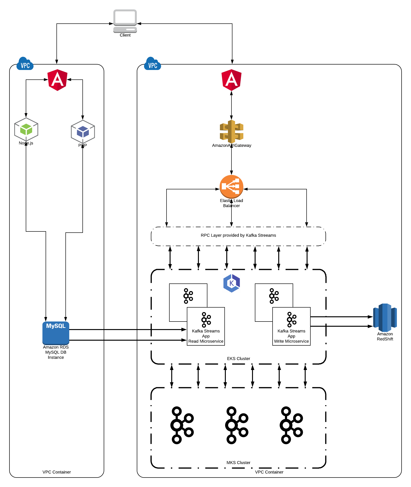

### Question 2 - Architecture Design
One of the most successful architectural implementations that I have seen when it comes to wiring a combination of
heterogeneous applications or micro-services is event sourcing or CQRS, especially when it comes to separate reads from
writes, which seems to be an important requirement. During this exercise, I won't be talking about the details of what
CQRS is (I will assume that you are familiar with the term), however I'll be explaining the benefits of this type of
architectures and how we can leverage it for our particular use case. But most importantly, I am going to describe how
a messaging/log system can be used as our backend control plane.

One of my assumptions is that we have to support both architectures for a given amount of time, with the idea that at
some point the legacy system is going to be shut down, and the transition from the legacy to the new system should be as
smooth as possible. Since one of the requirements mentions that we already have some infrastructure already set up in
AWS, I'll try to leverage as many manage services as possible (only the ones I am familiar with it).

#### Architectural Diagram

#### Explanation of the design
As I mentioned previously the fundamental part of my design is going to rely on Kafka, and I will use it as the
backend control plane. I decided to pick Kafka for various reason:

* Good observability and easy to monitor (JMX metrics are can be feed to our existing Prometheus installation).
* Leveraging Kafka for data pipelines could be useful in the future if we want to start doing more data analysis.
* RPC support for Kafka Streams, which makes KTables queryable via HTTP (I'll be taking more later on).
* MKS (Manage Kafka Streams) is another managed service under the AWS umbrella.

The main design will consist in two Kafka Streams applications that could scale completely independent from each other,
one Kafka Streams app will be in charge of pulling data from the legacy system, and the other will in charge of 
performing the writes to the new system. Given the requirement that the living in the legacy system is ephemeral, one
would imagine that we need to treat read and writes in different ways, making CQRS an excellent fit for this type of
architecture. The writes can be seen as commands which get validated and transformed into events, and on the other hand,
reads are queries which are powered by a materialized view of any database.

#### Kafka Streams (Read Micro-service)
Since one of the requirements is been able to serve up to 300k concurrent students pulling data from the legacy system,
this seems to be a good opportunity to leverage KTables from Kafka Streams. KTables allow us to build materialized views
for any database flavor by simply querying the backend database and replicating the information into the KTable, this
type of implementation could serve as a good caching mechanism for ephemeral data. KTables are backed up by RocksDB and 
RocksDB allow writes to disk so our only constrain is the imposed by the disk size.
It is important to mention that when the times comes we could potentially shutdown the legacy system and build a
materialized view on top of a different database. With this contract clients of our API will not have to change after we
shutdown the old system. The las important thing related to this architecture is that KTables can be exposed via RCP,
meaning they can be consumed directly from the new front end architecture via HTTP.

#### Kafka Streams (Write micro-service)
The micro-service or Kafka stream application will be in charge of performing the writes for our new system but will be
also responsible for updating the KTable of the materialized view constructed by the read micro-service. Since we are
using even sourcing, we can have another consumer that also sinks the results to our backend database, which for this
case I picked Redshift. The reason behind this decision is because Redshift leverages Postgres years of development and
also brings NoSQL capabilities to the table. Since we are trying to use as much mange services as possible, this seems
to be a good decision that fits well with our architectural design.

#### API Gateway ELB
The RPC endpoints expose via REST by the read and write micro-services, will be load balanced using an ELB. On top of
the ELB we can put an API Gateway that will help us getting all necessary SLO's and metrics that our API might need to
publish.

#### Deployment Flexibility
One interesting part of the proposed solution is the flexibility we can get when it comes to deploying. We can continue
leveraging MKS and deploy our Kafka Streams via EC2 containers. Or we can leverage MKS for the Kafka cluster
provisioning and deploy our Kafka Streams to EKS, that way we can leverage K8S autoscaling/monitoring/RBAC capabilities
among others.

#### Final Considerations
Although I am satisfied with the proposed solution, if we didn't have the requirement to build on top of the old legacy
angular components, I most likely would have built my solution around Lightbend stack, meaning Lagom in conjunction with
Akka Streams and Play. 
